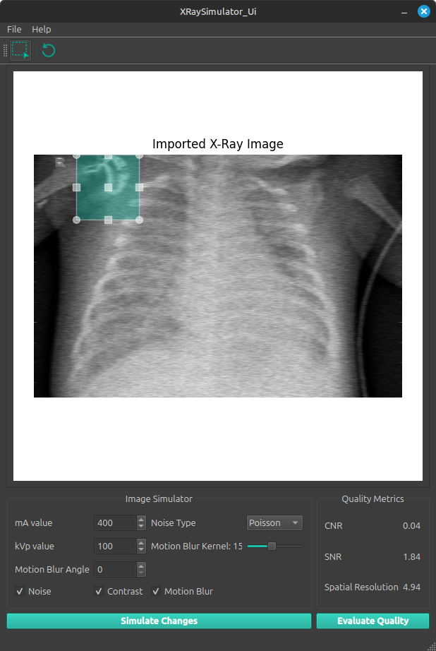

# X-Ray Tube Simulation and Quality Metrics Assessment

[](https://opensource.org/licenses/MIT)
[](https://www.python.org/downloads/)
[](https://pypi.org/project/PyQt5/)

## Description

This project provides a comprehensive tool for simulating and analyzing X-ray tube parameters and their effects on image quality. It features a user-friendly GUI interface built with PyQt5 that allows users to:

- Import and analyze X-ray images
- Simulate various X-ray tube parameters (kVp, mA)
- Apply different types of noise and artifacts
- Calculate key quality metrics:
  - Contrast-to-Noise Ratio (CNR)
  - Signal-to-Noise Ratio (SNR)
  - Spatial Resolution
- Synthesize new X-ray images with customizable parameters
- Visualize and compare results

## Quick Preview



## Features

### Image Analysis

- Import various image formats (PNG, JPG, JPEG, BMP, PPM, PGM)
- Interactive ROI (Region of Interest) selection
- Real-time quality metrics calculation
- Image normalization and preprocessing

### Simulation Capabilities

- Adjustable X-ray tube parameters:
  - Tube current (mA)
  - Tube voltage (kVp)
- Noise simulation:
  - Poisson noise
  - Custom noise types
- Motion blur simulation:
  - Adjustable kernel size
  - Customizable blur angle
- High-pass filtering

### Quality Metrics

- CNR (Contrast-to-Noise Ratio) calculation
- SNR (Signal-to-Noise Ratio) assessment
- Spatial resolution measurement
- Real-time metric updates

## How to Use

1. **Ensure Python is Installed**  
    Make sure Python (version 3.8 or higher) is installed on your system. You can download it from [python.org](https://www.python.org/).

2. **Create a Virtual Environment**  
    - **Linux/MacOS**:  
      ```bash
      python3 -m venv env
      source env/bin/activate
      ```
    - **Windows**:  
      ```bash
      python -m venv env
      .\env\Scripts\activate
      ```

3. **Install Dependencies**  
    Navigate to the project directory and install the required packages:  
    ```bash
    pip install -r requirements.txt
    ```

4. **Run the Application**  
    Execute the main script:  
    ```bash
    python app/src/main.py
    ```

### Basic Usage Guide

1. **Import an Image**
   - Use File → Import Image to load an X-ray image
   - Supported formats: PNG, JPG, JPEG, BMP, PPM, PGM

2. **Select ROI**
   - Click the "Rectangle ROI" button
   - Draw a rectangle on the image to select the region of interest
   - The background will be automatically selected

3. **Evaluate Quality**
   - Click "Evaluate Metrics" to calculate CNR, SNR, and spatial resolution
   - Results will be displayed in the metrics panel

4. **Simulate Changes**
   - Adjust simulation parameters (mA, kVp, noise, motion blur)
   - Click "Simulate Changes" to apply the modifications
   - Compare the results with the original image

5. **Save Results**
   - Use File → Save Image to export the simulated image
   - Results can be saved in various formats

<!-- ## References

[Add relevant references and papers here] -->

## Contribution

Our gratitude to our wonderful team ❤️

<div align="center">

| <a href="https://github.com/cln-Kafka"></a> | <a href="https://github.com/HabibaSroor"></a> | <a href="https://github.com/LunaEyad"></a> | <a href="https://github.com/mohamedmosilhy"></a> | <a href="https://github.com/Sarah2332"></a> |
| :-: | :-: | :-: | :-: | :-: |
| [Kareem Noureddine](https://github.com/cln-Kafka) | [Habiba Sroor](https://github.com/joyou159) | [Luna Eyad](https://github.com/Nadaaomran) | [Mohamed Moselhi](https://github.com/nouran-19) | [Sara Mohamed](https://github.com/Sarah2332) |

</div>

-----

This project is licensed under the MIT License. See the [LICENSE](./LICENSE) file for more details.
